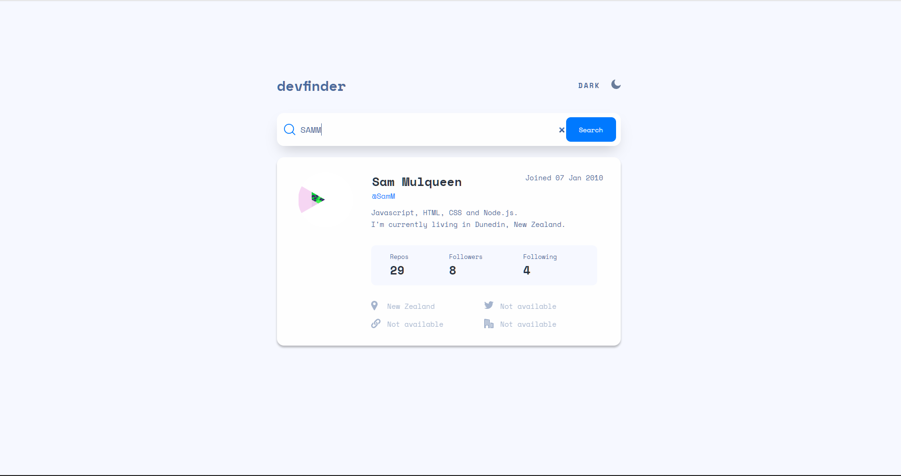
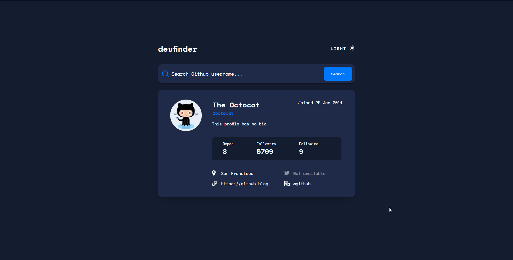

# FRONTEND_TASK

## Table of contents

- [Overview](#overview)
  - [The challenge](#the-challenge)
  - [Screenshot](#screenshot)

## Overview

### The challenge

Users should be able to:
- Clone The Repository
- View the optimal layout for the app depending on their device's screen size
- See hover states for all interactive elements on the page
- Search for GitHub users by their username
- See relevant user information based on their search
- Switch between light and dark themes
- Use React and Redux and any UI library of your choice (Preferably Antd) to build the application 
- Once Done Host the website on Netlify or any other hosting service of your choice

### API
https://api.github.com/users/$username

### Screenshot

### Working

